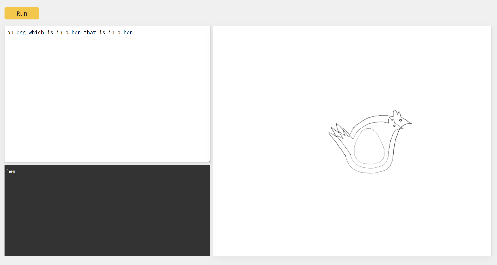

# Hen Language: A Philosophically Funny Adventure

Hen Language is a delightfully unserious programming language that centers around the timeless question: which comes first, the hen or the egg? Dive into the world of nested structures and explore the interplay between hens and eggs as you write programs in this language.

## Syntax

The syntax of Hen Language is simple. Programs are composed of nested structures containing hens and eggs, with optional conjunctions 'which' and 'that' to provide clarity. Here's a breakdown of the syntax:

- **Values**: rograms primarily consist of two simple values: _Hen_ and _Egg_.

- **Conjunctions**: Use 'which' or 'that' to connect clauses within a nested structure.

- **Modals**: Introduce additional complexity with keywords like 'has' and 'is in' to describe the relationship between hens and eggs.

Below is the grammar for the Hen Language:

```
statement = creature_clause | comment

creature_clause = article creature relative_clause?

article = "a" | "an"

creature = "Hen" | "Egg"

relative_clause = relative_preposition (article creature | creature_clause)

relative_preposition = "that" | "which" | "has" | "is in"

comment = "#" (! "\n")* "\n"

```

## Usage/Examples

Here's a taste of what you can do with Hen Language:

```
# First program
# Comments go after sharp sign
# Hen is a case-insensitive language
a Hen
```

```
#second program
a hen has an egg
```

```
#third program
an egg is in a hen
```

```
#4th program
a hen that is in an egg which is in an egg
```

## Getting Started

To begin using Hen Language, clone this repository and open the index.html file in your preferred browser. Write your nested structures in the provided editor, then click 'Run' to observe which creature takes precedence in each scenario. Additionally, enjoy the visual representations of your nested structures in the adjacent box, providing a simple yet engaging view of your programming journey with hens and eggs. Have fun exploring the world of Hen Language!

## Demo


